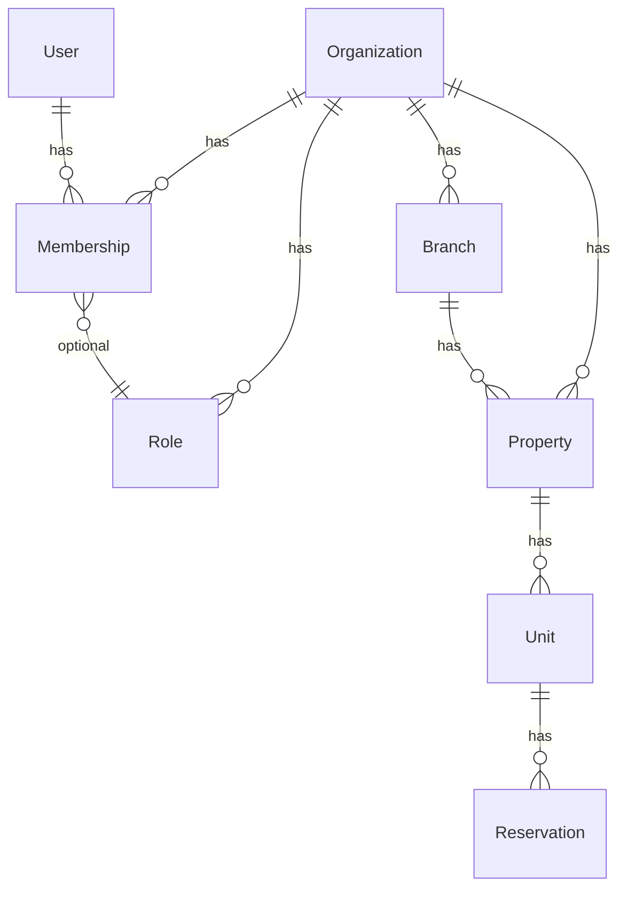

# Apartus — Data Schema

> Единый справочник по моделям, полям и связям.
> Обновляется при каждом изменении структуры БД.

---

## Conventions

- Money fields: integer with `_cents` suffix (e.g. `total_cents`)
- Enums: Rails enums, stored as integers
- Timestamps: `created_at`, `updated_at` on all tables
- Foreign keys: `belongs_to` with DB-level constraints
- Soft delete: not used unless explicitly decided (see DECISIONS.md)
- UUIDs: not used, standard bigint PKs

---

## Models

> Models are grouped by phase. Each model lists fields, associations, and enums.
> Format: `field_name : type (constraint/default)` — associations listed separately.

### Phase 1: Auth & Multi-tenancy

#### User

| Field | Type | Notes |
|-------|------|-------|
| id | bigint | PK |
| email | string | unique, not null |
| password_digest | string | not null (bcrypt) |
| first_name | string | not null |
| last_name | string | not null |
| settings | jsonb | default: {} |

**Associations:** has_many :memberships, has_many :organizations through :memberships
**Validations:** email presence/uniqueness/format, name presence, password min 8

#### Organization

| Field | Type | Notes |
|-------|------|-------|
| id | bigint | PK |
| name | string | not null |
| slug | string | unique, not null, auto-generated |
| settings | jsonb | default: {} |

**Associations:** has_many :memberships, has_many :users through :memberships, has_many :roles
**Callbacks:** before_validation :generate_slug, after_create :create_preset_roles

#### Membership

| Field | Type | Notes |
|-------|------|-------|
| id | bigint | PK |
| user_id | bigint | FK, not null |
| organization_id | bigint | FK, not null |
| role_id | bigint | FK, optional |
| role_enum | integer | default: 0 (member) |

**Associations:** belongs_to :user, belongs_to :organization, belongs_to :role (optional)
**Enums:** role_enum: { member: 0, manager: 1, owner: 2 }
**Unique index:** [user_id, organization_id]

#### Role

| Field | Type | Notes |
|-------|------|-------|
| id | bigint | PK |
| organization_id | bigint | FK, not null |
| name | string | not null |
| code | string | not null |
| permissions | text[] | PostgreSQL array, default: [] |
| is_system | boolean | default: false |

**Associations:** belongs_to :organization, has_many :memberships
**Unique index:** [organization_id, code]

#### JwtDenylist

| Field | Type | Notes |
|-------|------|-------|
| id | bigint | PK |
| jti | string | unique, not null |
| exp | datetime | not null |

**Unique index:** jti

<!-- Template:
#### ModelName
| Field | Type | Notes |
|-------|------|-------|
| id | bigint | PK |

**Associations:** belongs_to :x, has_many :y
**Enums:** status: { active: 0, archived: 1 }
**Validations:** presence, uniqueness, etc.
-->

### Phase 2: Properties & Units

#### Property

| Field | Type | Notes |
|-------|------|-------|
| id | bigint | PK |
| organization_id | bigint | FK, not null, on_delete: cascade |
| name | string(255) | not null, normalized strip |
| address | string(500) | not null, normalized strip |
| property_type | integer (enum) | not null |
| description | text | optional, max 5000 chars |

**Associations:** belongs_to :organization
**Enums:** property_type: { apartment: 0, hotel: 1, house: 2, hostel: 3 } (validated via `validate: true`)
**Validations:** name/address presence + length, description length <= 5000
**Indexes:** [organization_id], [organization_id, id]

> `branch_id` intentionally omitted in F1; added in F5 (Property↔Branch).

### Phase 3: Booking Calendar

_Not yet implemented_

### Phase 4: Pricing

_Not yet implemented_

### Phase 5: Guests & CRM

_Not yet implemented_

### Phase 6: Payments & Finance

_Not yet implemented_

### Phase 7: Owners

_Not yet implemented_

### Phase 8: Tasks & Maintenance

_Not yet implemented_

### Phase 9: Booking Widget

_Not yet implemented_

### Phase 10: Channel Manager

_Not yet implemented_

### Phase 11: Communications

_Not yet implemented_

### Phase 12: Advanced Features

_Not yet implemented_

---

## ER Diagram (text)

> Updated as models are added. Mermaid syntax for rendering.

