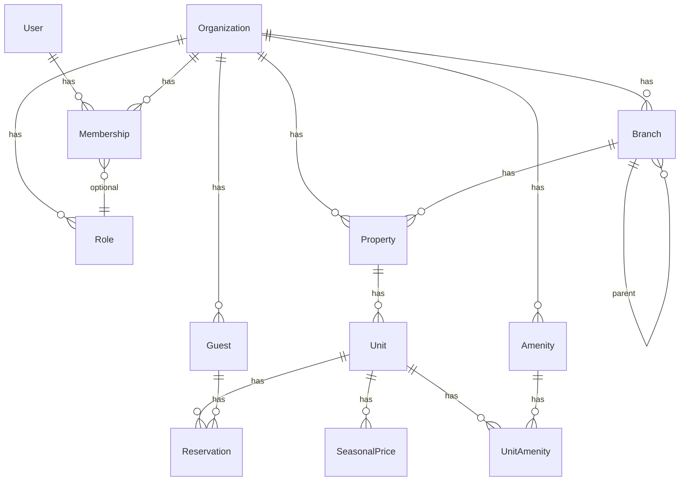

# Current Schema

Текущее состояние моделей. Только то, что реально существует в коде. Future-phase модели здесь **не** перечисляются — они живут в [`problem.md`](problem.md) как capability roadmap.

## Conventions

- Money: integer `_cents`
- Enums: Rails enums, integer storage, `validate: true`
- Timestamps: `created_at`, `updated_at` везде
- FK: `belongs_to` + DB constraints
- PK: bigint

## User

| Field | Type | Notes |
|---|---|---|
| id | bigint | PK |
| email | string | unique, not null |
| password_digest | string | not null (bcrypt) |
| first_name | string | not null |
| last_name | string | not null |
| settings | jsonb | default: {} |

**Associations:** `has_many :memberships`, `has_many :organizations through: :memberships`
**Validations:** email presence/uniqueness/format, name presence, password min 8

## Organization

| Field | Type | Notes |
|---|---|---|
| id | bigint | PK |
| name | string | not null |
| slug | string | unique, not null, auto-generated |
| settings | jsonb | default: {} |

**Associations:** `has_many :memberships`, `:users through :memberships`, `:roles`, `:properties`, `:units through :properties`, `:amenities`, `:branches`
**Callbacks:** `before_validation :generate_slug`, `after_create :create_preset_roles`

## Membership

| Field | Type | Notes |
|---|---|---|
| id | bigint | PK |
| user_id | bigint | FK, not null |
| organization_id | bigint | FK, not null |
| role_id | bigint | FK, optional |
| role_enum | integer | default: 0 |

**Associations:** `belongs_to :user`, `:organization`, `:role (optional)`
**Enums:** `role_enum: { member: 0, manager: 1, owner: 2 }`
**Unique index:** `[user_id, organization_id]`

## Role

| Field | Type | Notes |
|---|---|---|
| id | bigint | PK |
| organization_id | bigint | FK, not null |
| name | string | not null |
| code | string | not null |
| permissions | text[] | default: [] |
| is_system | boolean | default: false |

**Associations:** `belongs_to :organization`, `has_many :memberships`
**Unique index:** `[organization_id, code]`
См. [`../adr/ADR-011-permissions-text-array.md`](../adr/ADR-011-permissions-text-array.md).

## JwtDenylist

| Field | Type | Notes |
|---|---|---|
| id | bigint | PK |
| jti | string | unique, not null |
| exp | datetime | not null |

## Branch

| Field | Type | Notes |
|---|---|---|
| id | bigint | PK |
| organization_id | bigint | FK, not null, on_delete: cascade |
| parent_branch_id | bigint | self-FK, nullable, on_delete: restrict |
| name | string(100) | not null, normalized strip |

**Associations:** `belongs_to :organization`, `:parent_branch (class_name: Branch, optional: true)`, `has_many :children (class_name: Branch, foreign_key: :parent_branch_id)`, `:properties`; `before_destroy :prevent_destroy_if_has_dependents` (children или properties).
**Validations:** name presence + length + uniqueness (case-insensitive per `[organization_id, parent_branch_id]`); `parent_branch_must_exist_in_org`; `parent_is_not_self`; `parent_is_not_descendant` (on :update)
**Indexes:** `[organization_id]`, `[parent_branch_id]`, partial unique `(organization_id, parent_branch_id, LOWER(name)) WHERE parent_branch_id IS NOT NULL`, partial unique `(organization_id, LOWER(name)) WHERE parent_branch_id IS NULL`

Adjacency list tree, см. [`../adr/ADR-014-adjacency-list-branch-tree.md`](../adr/ADR-014-adjacency-list-branch-tree.md).

## Property

| Field | Type | Notes |
|---|---|---|
| id | bigint | PK |
| organization_id | bigint | FK, not null, on_delete: cascade |
| branch_id | bigint | FK, nullable, on_delete: restrict |
| name | string(255) | not null, normalized strip |
| address | string(500) | not null, normalized strip |
| property_type | integer (enum) | not null |
| description | text | optional, max 5000 chars |

**Associations:** `belongs_to :organization`, `:branch (optional)`, `has_many :units (dependent: :destroy)`
**Enums:** `property_type: { apartment: 0, hotel: 1, house: 2, hostel: 3 }` (validated)
**Validations:** name/address presence + length, description length ≤ 5000, `branch_must_exist_in_org` (custom — проверяет organization match)
**Indexes:** `[organization_id]`, `[organization_id, id]`, `[branch_id]`

## Unit

| Field | Type | Notes |
|---|---|---|
| id | bigint | PK |
| property_id | bigint | FK, not null, on_delete: cascade |
| name | string(255) | not null, normalized strip |
| unit_type | integer (enum) | not null |
| capacity | integer | not null, 1..100 |
| status | integer (enum) | not null |

**Associations:** `belongs_to :property`, `has_many :unit_amenities (dependent: :destroy)`, `has_many :amenities through: :unit_amenities`
**Enums:** `unit_type: { room: 0, apartment: 1, bed: 2, studio: 3 }` (validated); `status: { available: 0, maintenance: 1, blocked: 2 }` (validated)
**Validations:** name presence + length, capacity presence + numericality 1..100
**Indexes:** `[property_id]`, `[property_id, id]`

`organization_id` намеренно не хранится на Unit — derived через `unit.property.organization_id`. См. [`../features/FT-HW1-02-unit-crud/feature.md`](../features/FT-HW1-02-unit-crud/feature.md).

## Amenity

| Field | Type | Notes |
|---|---|---|
| id | bigint | PK |
| organization_id | bigint | FK, not null, on_delete: cascade |
| name | string(100) | not null, normalized strip |

**Associations:** `belongs_to :organization`, `has_many :unit_amenities`, `:units through: :unit_amenities`; `before_destroy` callback блокирует удаление, если есть `unit_amenities` (controller отвечает 409).
**Validations:** name presence + length(≤100) + uniqueness (case-insensitive per organization)
**Indexes:** `[organization_id]`, unique `[organization_id, LOWER(name)]`

## UnitAmenity (join)

| Field | Type | Notes |
|---|---|---|
| id | bigint | PK |
| unit_id | bigint | FK, not null, on_delete: cascade |
| amenity_id | bigint | FK, not null, on_delete: restrict |

**Associations:** `belongs_to :unit`, `:amenity`
**Validations:** uniqueness `[unit_id, amenity_id]`
**Indexes:** `[unit_id]`, `[amenity_id]`, unique `[unit_id, amenity_id]`

DB-level `ON DELETE RESTRICT` на `amenity_id` — второй рубеж инварианта "amenity in use"; основная защита — `Amenity#before_destroy`. См. [`../adr/ADR-013-has-many-through-m2n.md`](../adr/ADR-013-has-many-through-m2n.md).

## Guest

| Field | Type | Notes |
|---|---|---|
| id | bigint | PK |
| organization_id | bigint | FK, not null, on_delete: cascade |
| first_name | string(255) | not null |
| last_name | string(255) | not null |
| email | string(255) | optional, unique per org (partial index where email IS NOT NULL) |
| phone | string(50) | optional |
| notes | text | optional |

**Associations:** `belongs_to :organization`
**Validations:** first_name/last_name presence + length, email uniqueness per org (case-insensitive, allow_blank), phone length
**Indexes:** `[organization_id]`, partial unique `[organization_id, LOWER(email)] WHERE email IS NOT NULL`

## Reservation

| Field | Type | Notes |
|---|---|---|
| id | bigint | PK |
| unit_id | bigint | FK, not null, on_delete: cascade |
| guest_id | bigint | FK, nullable, on_delete: nullify |
| check_in | date | not null |
| check_out | date | not null, > check_in |
| status | integer (enum) | not null, default: confirmed |
| guests_count | integer | not null, default: 1, ≥1 |
| total_price_cents | integer | not null, default: 0, ≥0 |
| notes | text | optional |

**Associations:** `belongs_to :unit`, `belongs_to :guest (optional)`
**Enums:** `status: { confirmed: 0, checked_in: 1, checked_out: 2, cancelled: 3 }`
**Validations:** check_out > check_in, no overlapping active reservations per unit
**DB constraint:** `EXCLUDE USING gist (unit_id WITH =, daterange(check_in, check_out) WITH &&) WHERE (status IN (0, 1))`

## SeasonalPrice

| Field | Type | Notes |
|---|---|---|
| id | bigint | PK |
| unit_id | bigint | FK, not null, on_delete: cascade |
| start_date | date | not null |
| end_date | date | not null, > start_date |
| price_cents | integer | not null, default: 0, ≥0 |

**Associations:** `belongs_to :unit`
**Note:** Unit also has `base_price_cents` (integer, default 0) — fallback when no seasonal price matches a night.

## ER diagram

